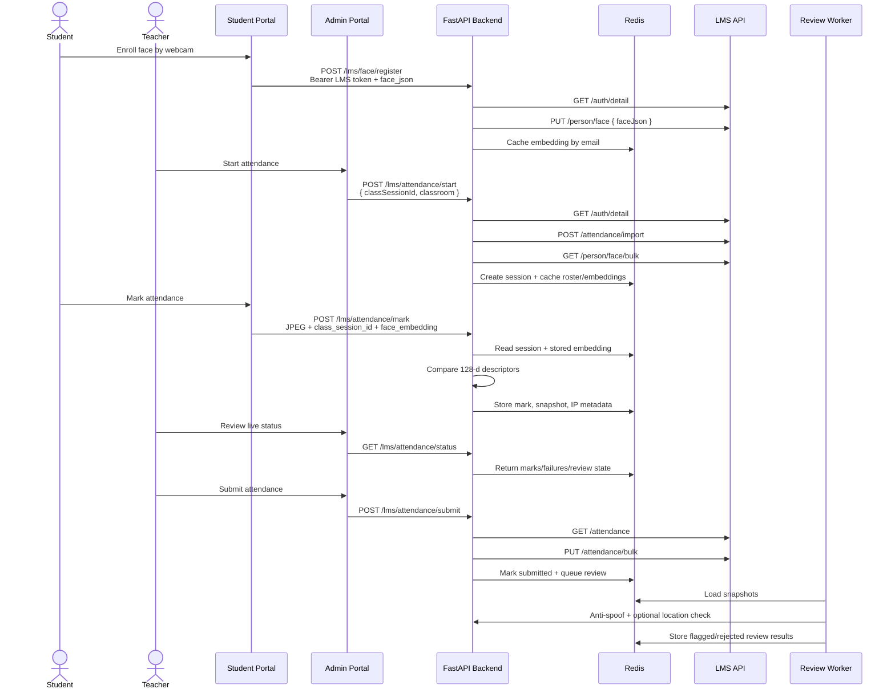

# AI Attendance System Documentation

This is the single onboarding and operations guide for the AI attendance system. It covers the standalone `ai-attendance` frontend, the FastAPI backend, and the LMS-integrated attendance flow used by admin/student portals.


## System Architecture

The system has two supported modes:

- LMS-integrated mode: production-oriented flow where admin/student portals authenticate with the LMS, the backend validates LMS bearer tokens, Redis stores live attendance session state, and final attendance is submitted back to LMS attendance services.
- Standalone demo mode: the repo's `frontend/` talks directly to non-LMS backend routes for local demos, local student registration, and basic session control.

### Components

| Component | Responsibility | Main files |
| --- | --- | --- |
| Student portal / face enrollment | Captures webcam image and browser `face-api.js` 128-d descriptor, sends it to the backend with LMS bearer token. | External student portal hooks; backend contract is `/lms/face/register` |
| Admin portal / teacher UI | Starts sessions, polls status/roster, submits attendance, reviews flags. | External admin portal; backend contract is `/lms/attendance/*` |
| `frontend/` | Standalone Next.js demo app for local registration, login, admin, student marking. | `frontend/app/*`, `frontend/lib/api.ts` |
| FastAPI backend | CORS, LMS auth proxy, face registration, matching, Redis session state, spoof/location review. | `backend/main.py`, `backend/lms_attendance_routes.py`, `backend/lms_client.py` |
| LMS API | Source of truth for auth, person face records, attendance rows, and bulk updates. | Called through `backend/lms_client.py` |
| Redis | Live LMS attendance sessions, marks, failures, snapshots, cached face embeddings, review queue. | `backend/lms_redis_store.py`, `backend/redis_client.py` |
| Local JSON store | Standalone demo student/session persistence. | `backend/data/`, `backend/local_db.py` |
| ML models | Browser face descriptors for identity; SilentFace anti-spoof; optional DINOv2 location classifier. | `backend/face_matching.py`, `backend/src/*`, `backend/ml_config.py` |

### LMS Flow Diagram



## End-to-End Flow

1. Student enrolls face in the student portal.
   The browser creates a `face-api.js` descriptor and sends it as `face_json` to `POST /lms/face/register`. The backend validates the LMS token, stores `{"embedding":[128 numbers]}` in LMS `PersonFace`, and caches it in Redis by email.

2. Teacher starts an attendance session.
   Admin portal calls `POST /lms/attendance/start` with `classSessionId` and optional `classroom`. The backend imports LMS attendance rows, creates a Redis session, fetches `/person/face/bulk`, and caches the class roster plus enrolled embeddings for fast marking.

3. Student marks attendance.
   Student portal calls `POST /lms/attendance/mark` with a JPEG snapshot, `class_session_id`, and a live `face_embedding`. The backend verifies the session is active, resolves the enrolled embedding, compares both 128-d descriptors, records success/failure in Redis, and stores the snapshot for review/admin display.

4. Teacher reviews live status.
   Admin portal polls `GET /lms/attendance/status` and/or `GET /lms/attendance/roster`. These are Redis-first for live data, with LMS calls used when roster enrichment is needed.

5. Teacher submits attendance.
   Admin portal calls `POST /lms/attendance/submit`. The backend loads LMS attendance rows, sends a bulk update with marked students as `PRESENT` and missing students as `ABSENT`, marks the Redis session submitted, and queues deferred anti-spoof/location review when enabled.

6. Ops/product reviews flags.
   Review results appear in Redis-backed status/roster responses. Anti-spoof failures become `Rejected`; wrong classroom/non-classroom location becomes `Flagged` when location detection is enabled.

## Local Development Setup

### Prerequisites

| Tool | Required for | Notes |
| --- | --- | --- |
| Python 3.9+ | Backend | Python 3.10+ recommended. |
| Node.js 20+ and npm 10+ | Frontend | Used by `frontend/`. |
| Redis 6+ | LMS-integrated routes | Required for `/lms/attendance/*`. |
| LMS API | LMS-integrated routes | Local default is `http://localhost:9090`; tunneled default can be configured. |
| Webcam-capable browser | Enrollment/marking | Browser must grant camera permission. |
| Model files | ML checks | See [Model assets](#model-assets). |

### Backend

```bash
cd backend
python -m venv venv
source venv/bin/activate
pip install -r requirements.txt
cp .env.example .env
uvicorn main:app --reload --host 0.0.0.0 --port 8000 --reload-exclude 'venv/*'
```

Health checks:

- Backend: `http://127.0.0.1:8000`
- OpenAPI docs: `http://127.0.0.1:8000/docs`

First startup may take a minute while ML models load. For fast API-only development, set `ENABLE_ANTI_SPOOF=false` and `ENABLE_LOCATION_DETECTION=false`.

### Redis

Run Redis locally before testing LMS-integrated sessions:

```bash
redis-server
redis-cli ping
```

Expected response: `PONG`.

The LMS Redis keys are namespaced under values like `lms:attendance:session:{class_session_id}`, `lms:attendance:marks:{class_session_id}`, `lms:attendance:face_embeddings:{class_session_id}`, and `lms:attendance:review_queue`.

### Frontend

```bash
cd frontend
npm install
npm run dev
```

Open `http://localhost:3000`.

For local Next.js dev, `NEXT_PUBLIC_API_URL` defaults to `http://127.0.0.1:8000` if unset. To override:

```bash
cd frontend
printf 'NEXT_PUBLIC_API_URL=http://127.0.0.1:8000\n' > .env.development.local
```

### LMS-Integrated Portal Setup

The external admin/student portals should point to the same FastAPI backend base URL and include the LMS access token as:

```http
Authorization: Bearer <lms_access_token>
```

Student portal enrollment and marking must send browser `face-api.js` descriptors. The backend rejects legacy/non-128-d embeddings for LMS flows.

## Environment Variables

### Backend

Defined in `backend/.env.example` and read by `backend/main.py`, `backend/lms_client.py`, `backend/redis_client.py`, `backend/face_matching.py`, and `backend/ml_config.py`.

| Variable | Required | Default | Description |
| --- | --- | --- | --- |
| `LMS_API_BASE` | LMS mode | `https://unmixed-virtual-chihuahua.ngrok-free.dev` | Primary LMS REST API base URL. |
| `LMS_API_LOCAL_FALLBACK` | No | `http://localhost:9090` | Same-machine LMS fallback. Preferred when `LMS_API_BASE` is ngrok. Set empty to disable. |
| `REDIS_HOST` | LMS mode | `10.5.2.165` in code, `localhost` in example | Redis host. Use `localhost` for local dev. |
| `REDIS_PORT` | LMS mode | `6379` | Redis port. |
| `REDIS_DB` | LMS mode | `0` | Redis database number. |
| `REDIS_PASSWORD` | No | unset | Redis password when required. |
| `CORS_ORIGINS` | No | unset | Comma-separated extra allowed origins. |
| `FRONTEND_URL` | No | unset | Standalone frontend origin; added to CORS. |
| `CORS_ORIGIN_REGEX` | No | built-in regex | Override default regex for Vercel, ngrok, Cloudflare tunnel, localhost, and LAN origins. |
| `ENABLE_ANTI_SPOOF` | No | `true` | Loads SilentFace models and rejects spoof snapshots. |
| `ENABLE_LOCATION_DETECTION` | No | `true` in code, `false` in example | Loads DINOv2 and `location_model.pkl`; flags wrong/non-classroom location. |
| `DEFER_ML_REVIEW` | No | `true` | If true, live marking only checks identity; spoof/location run after submit. |
| `REVIEW_CONCURRENCY` | No | `4` in code, `2` in example | Parallel batch size for deferred review. |
| `ENABLE_LOAD_TEST_SEED` | No | `false` in code, `true` in example | Enables synthetic mark seeding endpoints for load-test ML review benchmarks. |
| `FACE_API_DISTANCE_THRESHOLD` | No | `0.45` | Euclidean distance threshold for normalized 128-d face-api descriptors. Lower is stricter. |

Recommended local LMS `.env`:

```env
LMS_API_BASE=http://localhost:9090
LMS_API_LOCAL_FALLBACK=
REDIS_HOST=localhost
REDIS_PORT=6379
REDIS_DB=0
CORS_ORIGINS=http://localhost:3000,http://127.0.0.1:3000
ENABLE_ANTI_SPOOF=false
ENABLE_LOCATION_DETECTION=false
DEFER_ML_REVIEW=true
```

### Frontend

| Variable | Required | Description |
| --- | --- | --- |
| `NEXT_PUBLIC_API_URL` | Required on Vercel; optional locally | Browser-visible FastAPI base URL, no trailing slash. Must be public HTTPS when the frontend is served from Vercel. |
| `VERCEL` | Set by Vercel | When `1`, the build/runtime rejects private/LAN API hosts such as `127.0.0.1` or `192.168.x.x`. |

## Model Assets

### Browser `face-api.js`

The LMS-integrated pipeline expects a 128-dimensional descriptor generated in the browser, typically from `face-api.js` face recognition models. The backend does not generate LMS descriptors from images; it parses `face_json` and validates that the result is 128 numbers.

Accepted payload shapes include:

```json
{"embedding":[0.01,0.02]}
```

```json
{"descriptor":[0.01,0.02]}
```

```json
{"descriptors":[[0.01,0.02],[0.03,0.04]]}
```

When multiple descriptors are provided, the backend averages them if all are 128-d.

### Anti-Spoof

Required files when `ENABLE_ANTI_SPOOF=true`:

```text
backend/resources/anti_spoof_models/2.7_80x80_MiniFASNetV2.pth
backend/resources/anti_spoof_models/4_0_0_80x80_MiniFASNetV1SE.pth
backend/resources/detection_model/deploy.prototxt
backend/resources/detection_model/Widerface-RetinaFace.caffemodel
```

The anti-spoof pipeline uses Silent-Face-Anti-Spoofing code in `backend/src/`. It operates on the uploaded JPEG snapshot, independent of face descriptors.

### Location Detection

Required when `ENABLE_LOCATION_DETECTION=true`:

```text
backend/location_model.pkl
```

The backend also downloads/loads `facebook/dinov2-base` through Hugging Face Transformers. Disable location detection for offline startup or low-memory machines.

### InsightFace Note

Older README text and POC flows mention InsightFace. The LMS-integrated production contract currently supports browser `face-api.js` 128-d descriptors only. If a stored LMS `PersonFace.faceJson` contains a legacy non-128-d embedding, marking returns a re-enrollment message.

## API Reference

All LMS routes live under `/lms` and require:

```http
Authorization: Bearer <lms_access_token>
```

The backend validates tokens by calling LMS `GET /auth/detail`.

### LMS Face Enrollment

#### `POST /lms/face/register`

Registers or replaces the authenticated student's face embedding in LMS `PersonFace`.

Request: `multipart/form-data`

| Field | Type | Required | Notes |
| --- | --- | --- | --- |
| `face_json` | string | Yes | JSON containing a 128-d `embedding`, `descriptor`, `embeddings`, or `descriptors`. |

Response:

```json
{"success":true,"message":"Face registered successfully"}
```

Common failures:

- `Only browser face-api.js (128-dim) face descriptors are supported. Re-enroll in the student portal.`
- `Could not save face data to LMS`

### LMS Attendance Routes

#### `POST /lms/attendance/start`

Starts a Redis-backed class session, imports LMS attendance rows, and preloads face roster/embeddings.

Request JSON:

```json
{"classSessionId":123,"classroom":"Classroom 1"}
```

`class_session_id` is also accepted.

Response includes:

```json
{
  "success": true,
  "message": "Attendance session started",
  "started_at": "2026-07-09T...",
  "classroom": "Classroom 1",
  "class_session_id": 123,
  "face_embeddings_loaded": 28,
  "students_enrolled": 30,
  "students_with_face_data": 28
}
```

#### `GET /lms/attendance/status?class_session_id=123`

Returns Redis-only live status. It intentionally avoids an LMS round trip during polling.

Response includes active/submitted flags, review state, marked students, failed mark attempts, `teacher_ip`, expected classroom, and counts.

#### `GET /lms/attendance/student-status?class_session_id=123`

Returns the authenticated student's Redis status for the class session.

Response fields include `attendance_active`, `already_marked`, `session_submitted`, `mark_status`, `review_status`, and `marked_at`.

#### `GET /lms/attendance/roster?class_session_id=123`

Returns the roster with LMS attendance rows enriched by Redis marks/failures and face registration status.

#### `POST /lms/attendance/mark`

Marks attendance for the authenticated student.

Request: `multipart/form-data`

| Field | Type | Required | Notes |
| --- | --- | --- | --- |
| `file` | JPEG upload | Yes | Webcam snapshot stored for admin/review. |
| `class_session_id` | int | Yes | Active class session ID. |
| `face_embedding` | string | Yes | JSON with live 128-d face-api descriptor. |

Success response:

```json
{
  "success": true,
  "verified": true,
  "message": "Attendance marked successfully",
  "similarity": 0.93,
  "marked_at": "2026-07-09T...",
  "status": "Present",
  "review_status": "pending",
  "ip_match": true
}
```

Important behavior:

- The student gets two face-match attempts per session.
- If `DEFER_ML_REVIEW=true`, live marking checks only descriptor match; anti-spoof/location review runs after submit.
- If `DEFER_ML_REVIEW=false`, spoof and location checks run during marking.
- Re-marking an already marked session returns `already_marked: true`.

#### `GET /lms/attendance/snapshot/{class_session_id}/{email}`

Returns stored JPEG snapshot for a successful mark.

#### `GET /lms/attendance/failure-snapshot/{class_session_id}/{email}`

Returns stored JPEG snapshot for the latest failed mark attempt.

#### `POST /lms/attendance/submit`

Submits final attendance to LMS.

Request JSON:

```json
{"classSessionId":123}
```

The backend reads LMS attendance rows, maps marked students to `PRESENT`, missing students to `ABSENT`, calls LMS `PUT /attendance/bulk`, marks the Redis session submitted, and queues review when `DEFER_ML_REVIEW=true`.

#### `POST /lms/attendance/review`

Queues or re-runs spoof/location review after submit.

Request JSON:

```json
{"classSessionId":123,"force":false}
```

#### `POST /lms/attendance/stop`

Stops and clears the Redis session without submitting to LMS. Use this for cancellation or cleanup, not normal final submission.

### Load-Test-Only LMS Routes

Enabled only when `ENABLE_LOAD_TEST_SEED=true`.

| Method | Path | Purpose |
| --- | --- | --- |
| `POST` | `/lms/attendance/load-test/seed-marks` | Seed synthetic marks with the same JPEG snapshot. |
| `POST` | `/lms/attendance/load-test/submit-for-review` | Mark Redis session submitted without LMS bulk update. |

### Standalone Demo Routes

These routes support the repo's `frontend/` app and local JSON store. They are useful for demos, but are not the LMS production contract.

| Method | Path | Purpose |
| --- | --- | --- |
| `GET` | `/` | Health check. |
| `POST` | `/register-student` | Register local student with webcam scans. |
| `POST` | `/auth/login` | Local face login; returns local bearer token. |
| `GET` | `/auth/me` | Current local student. |
| `GET` | `/students` | List local students. |
| `POST` | `/attendance/start` | Start standalone attendance session. |
| `POST` | `/attendance/stop` | Stop standalone attendance session. |
| `GET` | `/attendance/status` | Standalone session status. |
| `GET` | `/students/me/status` | Standalone student attendance state. |
| `POST` | `/students/me/mark-attendance` | Standalone mark flow. |

## Face Pipeline

### Enrollment

1. Browser loads `face-api.js` models.
2. Browser captures one or more face descriptors.
3. Student portal sends JSON descriptor payload as `face_json`.
4. Backend parses and validates exactly 128 dimensions.
5. Backend sends `PUT /person/face` to LMS with `{"faceJson":"{\"embedding\":[...]}"}`.
6. Backend caches the embedding in Redis for faster future marking.

### Matching

`backend/face_matching.py` normalizes both stored and live descriptors, then computes:

- cosine similarity for reporting
- Euclidean distance for pass/fail

Default pass threshold:

```text
FACE_API_DISTANCE_THRESHOLD=0.45
```

The `face-api.js` default matcher threshold is commonly looser; this backend uses a stricter default for 1:1 account binding. Tune this only with real false-accept/false-reject data.

### Anti-Spoof

Anti-spoof checks operate on the JPEG snapshot, not the descriptor. If enabled, SilentFace returns real/spoof and confidence. With deferred review enabled, a spoof result can later mark a submitted record as `Rejected` with reason `Spoof detected`.

### Location

Location detection uses DINOv2 image embeddings and `location_model.pkl` to classify:

- `Classroom 1`
- `Classroom 2`
- `Classroom 3`
- `Non-Classroom`

When enabled, `Non-Classroom` becomes `Flagged: Outside Classroom`; a classroom mismatch becomes `Flagged: Wrong Classroom`.

### IP Metadata

The backend stores teacher and student request IPs and computes `ip_match`. IP mismatch is recorded as `ip_flagged`, but deferred review status is based on anti-spoof/location checks.

## Deployment

### Vercel Frontend + Local/Tunneled Backend

The browser calls FastAPI directly. A Vercel page cannot call `127.0.0.1`, `localhost`, or a LAN IP on your laptop. Use a public HTTPS tunnel.

1. Run backend:

   ```bash
   cd backend
   source venv/bin/activate
   uvicorn main:app --host 0.0.0.0 --port 8000
   ```

2. Expose it:

   ```bash
   ngrok http 8000
   ```

   Or use Cloudflare Tunnel pointed at `http://localhost:8000`.

3. Configure Vercel project with root directory `frontend`:

   ```text
   NEXT_PUBLIC_API_URL=https://your-public-tunnel.example.com
   ```

4. Configure backend CORS if needed:

   ```env
   FRONTEND_URL=https://your-app.vercel.app
   CORS_ORIGINS=https://your-app.vercel.app
   ```

The backend already allows Vercel previews, ngrok, Cloudflare Tunnel, localhost, and LAN hosts through the default CORS regex.

### Production Checklist

- [ ] `NEXT_PUBLIC_API_URL` is public HTTPS and has no trailing slash.
- [ ] Backend `/` and `/docs` are reachable through the same URL the browser uses.
- [ ] Redis is reachable from the backend and protected appropriately.
- [ ] `LMS_API_BASE` points to the target LMS environment.
- [ ] Tokens used by portals come from the same LMS environment as `LMS_API_BASE`.
- [ ] CORS includes admin and student portal origins.
- [ ] `ENABLE_ANTI_SPOOF` and `ENABLE_LOCATION_DETECTION` match available model assets and machine capacity.
- [ ] `ENABLE_LOAD_TEST_SEED=false` outside load-test environments.
- [ ] Logs do not expose bearer tokens in production. Current request logging includes access tokens and should be reduced before handling real production traffic.
- [ ] `backend/data/` local demo data is not treated as production storage.
- [ ] At least one non-POC engineer has reviewed this document and run through the start/mark/submit path.

## Troubleshooting

| Symptom | Likely cause | Fix |
| --- | --- | --- |
| ngrok returns `502` for `OPTIONS /auth/login` or `/lms/...` | Tunnel is up but backend is not healthy on port 8000. | Open `http://127.0.0.1:8000`; restart uvicorn; verify `Application startup complete`; check `lsof -i :8000`. |
| Browser CORS error from Vercel | API URL is wrong, backend is down, or origin is not allowed. | Confirm `NEXT_PUBLIC_API_URL` is HTTPS tunnel URL; add portal origin to `CORS_ORIGINS`; verify backend receives the request. |
| Vercel build fails because API URL is private/LAN | `NEXT_PUBLIC_API_URL` points to `localhost`, `127.*`, `192.168.*`, `10.*`, or private `172.16-31.*`. | Use ngrok/Cloudflare HTTPS URL. |
| `LMS rejected access token` | Token does not belong to configured LMS environment or expired. | Re-login in the matching portal/environment; verify `LMS_API_BASE`. |
| `/lms/attendance/start` fails loading face data | LMS `/person/face/bulk` unreachable or class session mismatch. | Check LMS API logs, token role, `classSessionId`, and backend outbound connectivity. |
| Student sees `Face not registered` | LMS has no `PersonFace` record or session cache was missing and LMS lookup failed. | Re-enroll; verify `/person/face`; restart session after enrollment if needed. |
| Student sees `Only browser face-api.js (128-dim)...` | Missing `face_embedding` or legacy non-128-d stored/live embedding. | Update student portal to send descriptor; re-enroll face. |
| Student sees face mismatch | Descriptor distance exceeded `FACE_API_DISTANCE_THRESHOLD`. | Ensure same student, good lighting, face centered; retry once; review failure snapshot. |
| Student is locked out after failures | Two failed face-match attempts for that session. | Instructor should inspect failed snapshots and handle manually; clearing Redis session resets attempts. |
| Anti-spoof model load fails | Missing `.pth`, detection model files, PyTorch issue, or low memory. | Verify files in `backend/resources/`; set `ENABLE_ANTI_SPOOF=false` for non-ML dev. |
| Location model load fails | Missing `location_model.pkl` or DINOv2 cannot load/download. | Set `ENABLE_LOCATION_DETECTION=false` or install model assets/network cache. |
| Redis connection error | Redis not running or wrong host. | Start Redis; set `REDIS_HOST=localhost`; run `redis-cli ping`. |
| Mark succeeds but review never completes | Review worker not running, Redis queue issue, ML model failure. | Check backend logs for `review_status`, `review_error`; try `POST /lms/attendance/review` with `force:true`. |

## Load Testing

Load tests live in `backend/load_tests/` and target LMS-integrated routes.

### Setup

```bash
cd backend
pip install -r load_tests/requirements.txt
cp load_tests/secrets.example.env load_tests/secrets.env
```

Edit `load_tests/secrets.env`:

| Variable | Required | Meaning |
| --- | --- | --- |
| `LOAD_TEST_TEACHER_ACCESS_TOKEN` | Yes | LMS token for starting/polling/submitting sessions. |
| `LOAD_TEST_STUDENT_ACCESS_TOKEN` | Yes | LMS token for student mark flows. |
| `CLASS_SESSION_ID` | Yes | Existing LMS class session ID. |
| `LOCUST_HOST` | No | Target FastAPI host. Defaults to `http://127.0.0.1:8000`. |
| `LMS_API_BASE` | No | Optional LMS override for token validation. |

Use tokens from the same environment as `LOCUST_HOST` and `LMS_API_BASE`.

### Run

```bash
cd backend
./load_tests/run_all.sh
```

Individual runs:

```bash
./load_tests/run.sh
./load_tests/run_mark_session_test.sh
./load_tests/run_ml_review_test.sh
./load_tests/run_throughput_test.sh
./load_tests/run_mark_breakpoint.sh
```

### Reports

| Report | Meaning |
| --- | --- |
| `load_tests/index.html` | Dashboard linking generated reports. |
| `load_tests/report.html` | Polling and mark mix, commonly 100 concurrent users. |
| `load_tests/mark_report.html` | Mark burst, commonly 150 users in 30 seconds. |
| `load_tests/ml_review_benchmark_report.html` | Spoof + DINO review timing over synthetic marks. |
| `load_tests/throughput_summary.html` | Flat 100-user throughput summary. |
| `load_tests/mark_breakpoint_summary.html` | Breakpoint/concurrency sweep summary. |

### Interpreting Results

Focus on:

- Failure rate: authentication, Redis, and LMS 5xx failures should be zero for a valid environment.
- Mark latency: identity-only mark latency should be low when `DEFER_ML_REVIEW=true`; anti-spoof/location work moves to review.
- p95/p99 latency: spikes usually indicate LMS round trips, Redis contention, or ML model CPU/GPU saturation.
- Throughput saturation: breakpoint tests show the point where failure rate or p99 latency becomes unacceptable.
- Review duration: ML review benchmark is total time for spoof/location post-processing; tune `REVIEW_CONCURRENCY` with CPU/GPU memory in mind.

## Operational Notes

- Normal completion path is `start -> mark -> submit -> review`, not `stop`.
- Redis data is TTL-based; LMS remains the final attendance source of truth after submit.
- Failed marks and snapshots are stored in Redis for review and expire with the session TTL.
- The backend currently logs bearer tokens in request/LMS logs; sanitize this before real production use.
- Local `backend/data/` may contain demo student data and should not be committed or used as LMS production storage.

## Review Status

Documentation prepared from the current repo implementation. Acceptance requires review by at least one engineer who did not build the POC; record that review here:

| Reviewer | Date | Notes |
| --- | --- | --- |
| Pending | Pending | Non-POC engineering review still needed. |
